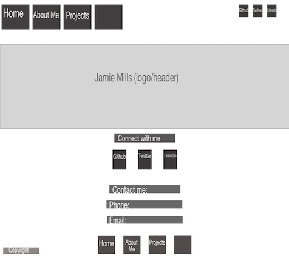
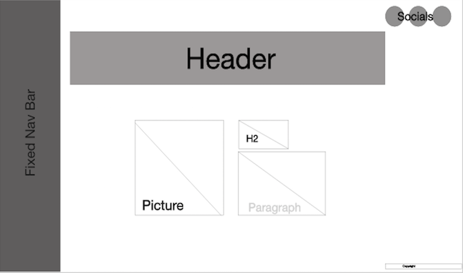

# Jamie Mills Portfolio

### Published portfolio website URL
* https://jamiemills98.github.io/jamies_portfolio/
### link to GitHub repository
* https://github.com/jamiemills98/jamies_portfolio
_________________________________________________________________________________________________________

## About This Website

### Purpose

The purpose of this website is to present my portfolio to potential employers.

### Functionality / features

### Sitemap

### Screenshots

### Target audience

My target audience is potential future employers. 

### Tech stack (e.g. HTML, CSS etc)
HTMl and CSS
Deployed on Github

## Design

### Design process
My design process started off with:
- a header/title across the top of the page
- a nav bar under the header/title
- social media links at the top right hand side 
- A connect section with contact info and social links
- copy right footer

 My inspiration mostly came from ; 

http://findmatthew.com (Matthew Williams)

and 

https://codepen.io/hrtzt/pen/NPZKRN (Alberto Hartzet)

Matthew started me off with the idea of a space theme (inspired by his animated background), this slowly moved into the sunset theme after making my moodboard and realizing the colors I chose resembled a sunset more than space. 

I was then inspired to change my nav bar after starting. I changed it to be a side nav bar rather than across the page under the header after seeing Alberto's Nav bar example. This made it look neater and easier to use. I also made it fixed so the user of my website can easily navigate while looking through the pages. 

I choose my background to imitate a pastel sunset. My text colours were left black and white depending on background so it is easier to read and nice to look at (too many colours could overwhelm the user). My text fonts are in the sans serif family as they are easy to read. I also chose to have a slightly lighter background on my header/titles to seperate it from the background.

Moodboard: 

## Wireframes
### Original Wireframes:

#### Iphone/mobile 
#### Home Page
 

##### About Me Page

#### Web 
##### Home Page
 

##### About Me Page

### Wireframes after design change: 

#### Iphone/mobile
##### Home Page
 

##### About Me Page

#### Web 
##### Home Page
 

##### About Me Page

### Personal logo (optional)

### Usability considerations

## Planning

### Project plan & timeline
(portfolio plan coggle)
Moodboards, wireframes and trello were also used in my project planning.

### Trello
####Trello boards
 
 
 
 
 
 

## Questions (Short Answers)

### Describe key events in the development of the internet from the 1980s to today (max. 150 words)

### Define and describes the relationship between fundamental aspects of the internet such as: domains, web servers, DNS, and web browsers (max. 150 words)

### Reflect on one aspect of the development of internet technologies and how it has contributed to the world today (max. 150 words)