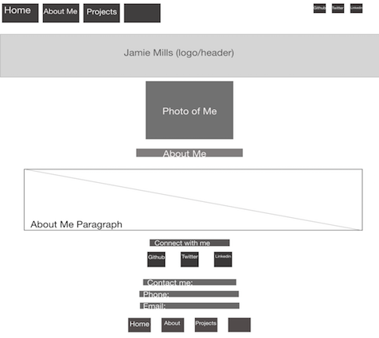
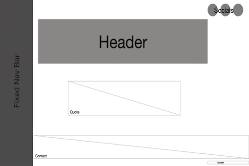

# Jamie Mills Portfolio

### Published portfolio website URL
* https://jamiemills98.github.io/jamies_portfolio/
### link to GitHub repository
* https://github.com/jamiemills98/jamies_portfolio
_________________________________________________________________________________________________________

## About This Website

### Purpose

The purpose of this website is to present my portfolio to potential employers, while incorporating my personality, current and previous work/experience so potential employers can get to know me on a faster and more efficient level. 

### Functionality / features
- My portfolio starts on the home page, it then has a fixed nav bar on every page so you can easily move through my about, history and project pages as well as easily getting back to the home page. 
- CSS flexbox is used as the foundation of the layout on each page.

##### My portfolio can viewed on most devices, I have used the following measurements to make this possible
1. max-width: 450px
2. min-width: 451px, max-width: 960px
3. min-width: 961px

### Sitemap

 

### Screenshots
#### Mobile
 
 
 
 

#### Tablet
 
 
 
 

#### Web

### Target audience

My target audience is potential future employers. I also want to reach fellow developers so that we can exchange ideas and learn from each other. 

### Tech stack (e.g. HTML, CSS etc)
- HTMl 
- SASS (CSS)
- Google fonts 
- flaticon
- Deployed on Github

## Design

### Design process
My design process started off with:
- a header/title across the top of the page
- a nav bar under the header/title
- social media links at the top right hand side 
- A connect section with contact info and social links
- copy right footer

 My inspiration mostly came from ; 

http://findmatthew.com (Matthew Williams)

and 

https://codepen.io/hrtzt/pen/NPZKRN (Alberto Hartzet)

- Matthew started me off with the idea of a space theme (inspired by his animated background), this slowly moved into the sunset theme after making my moodboard and realizing the colors I chose resembled a sunset more than space. 

- I was then inspired to change my nav bar after starting. I changed it to be a side nav bar rather than across the page under the header after seeing Alberto's Nav bar example. This made it look neater and easier to use. I also made it fixed so the user of my website can easily navigate while looking through the pages. 

I chose my background to imitate a pastel sunset. My text colours were left black and white depending on background so it is easier to read and nice to look at (too many colours could overwhelm the user). My text fonts are in the sans serif family as they are easy to read. I also chose to have a slightly lighter background on my header/titles to seperate it from the main background.

Moodboard: 

## Wireframes
### Original Wireframes:

#### Iphone/mobile 
##### Home Page
 

##### About Me Page

#### Web 
##### Home Page
 

##### About Me Page

### Wireframes after design change: 

#### Iphone/mobile
##### Home Page
 

##### About Me Page

#### Web 
##### Home Page
 

##### About Me Page

<!-- ### Personal logo (optional) -->

### Usability considerations

My usability considerations included:
- Easy to read font styles and sizes
- Easy to read font colours depending on background
- Slight colour change on background colour of headers to make them more clear
- alt tags on images
- I used a colour Contrast checker (the add-on suggested by Jordan in accessability lesson) (see screenshot below)

 

- I then ran my website through lighthouse to check my audits(see screenshots). All of my pages recieved a good score (although accessability can always be improved) except for my projects page, the main problem for this is that I used a gif instead of a video which could be a future enhancement.

 

## Planning

### Project plan & timeline
#### Planning timeline
 

- Moodboards, wireframes and trello were also used in my project planning.

### Trello
####Trello boards
 
 
 
 
 
 

## Questions (Short Answers)

### Describe key events in the development of the internet from the 1980s to today 
- In 1980 Radia Perlman designs Intermediate System IS-S, the protocol for IP routing. 
- In 1983 The Domain Name System (DNS) is created, so we can enter in a domain instead of long IP addresses. 
- In 1985 Symbolics Computer Corp. becomes the first registered domain name. 
- In 1989 Sir Tim Berners-Lee, invents the world wide web, 1 year after he then creates three technologies still used today: HyperText Markup Language (HTML), Uniform Resource Identifier (URI, more commonly known as URL) and Hypertext Transfer Protocol (HTTP). 
- In 1994 Microsoft developes windows 95 a consumer-oriented operating system. 
- 1995 Big marketplaces such as Amazon and Ebay, begin creating more appeal to be on the web. 
- 1998 is when web publishing tools became available, this started off a popularity of writing blogs and allowing people more of a chance to connect on the web. 
- Advertisements then started popping up and gaining traction in the early 2000's. 2004 - 2006 is when facebook, youtube and twitter get started, this invites everyday people to become part of the web and interact with each other in an easier way. Soon after many popular social medias etc. started, creating a must for people everywhere to be included and connected with each other. 

### Define and describes the relationship between fundamental aspects of the internet such as: domains, web servers, DNS, and web browsers

Every web server(such as computer) has a IP (Internet Protocal) address (a virtual address made of numbers). When we enter a URL (Uniform Resource Locator) into a web browser on our web server, the web browser looks for that URL in a DNS (Domain Name Server) which contains a list of URLs and their corresponding IP addresses. 
To break it down a bit the first part of a URL is called a protocol (usually http/s). This is a set method for exchanging/transferring data around a computer network. The second part of a URL is the domain name (www.domain.com). This is providing the DNS which web server is being requested, so we dont have to type in an IP address. You can use a search engine (like google) and only write the domain name in which is much easier to remember than an IP address. 

### Reflect on one aspect of the development of internet technologies and how it has contributed to the world today 

DNS (Domain Name Server) was created by Paul Mockapetric, in 1983. DNS was originally used to support email communications but is now an extremely helpful tool in today's world all around. We no longer have to remember each IP address for websites we want to visit. We only need to remember a (usually) short domain address, as DNS contains URLs and their corresponding IP addresses. This makes internet surfing, accessing different resources and communication, quick, efficient and almost effortless. 